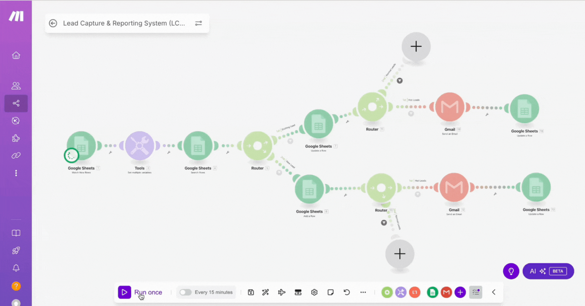

<h1 align="center">Lead Capture & Routing System (MVP)</h1>

## Overview
This demo is a **Make (formerly Integromat) automation** that captures leads from Google Forms into Google Sheets, cleans and enriches the data, scores each lead, and sends **HOT lead alerts** via email/Slack.

Form → Sheets (Leads_Raw) → Normalize & Dedupe → Update/Append (Leads_Clean) → Router (Hot/Normal) → Email Alert

**Workflow Overview:**  
1. A lead fills out a Google Form.  
2. The data goes into a Google Sheet (Leads_Raw).  
3. Make normalizes the data and generates a dedupe key (email).  
4. If the email already exists → the row is updated.  
5. If it’s new → a row is appended to Leads_Clean.  
6. If the lead is “hot” (budget > $5k) → an instant email alert is sent.  
7. The Leads_Clean sheet becomes the **reporting source of truth**.

---

## Features 
- **Google Sheets Integration** – Clean, normalized database of all leads.  
- **Lead Scoring** – HOT if budget ≥ 5000, otherwise Normal.  
- **Email Alerts** – Sends formatted Gmail alerts for HOT leads.  
- **Deduplication** – Prevents duplicate leads using normalized email key.  
- **Weekly Summary (optional)** – Digest of new leads for reporting.  

---

## 📂 Folder/Sheet Structure
- `Leads_Raw` → Captures raw form submissions.  
- `Leads_Clean` → Normalized, deduped, scored leads.  
- `Error_Log` → Tracks automation errors (optional).  

--- 

## 📬 Example Email Alert

---

## How It Works
- **Trigger:** Watch new rows in Leads_Raw (Google Sheets)  
- **Normalization:** Create variables (trim spaces, lowercase email, add dedupe_key, timestamp)  
- **Dedupe:** Search Leads_Clean for email  
  - If found → Update Row (refresh notes, last_updated_at)  
  - If not → Add Row (insert normalized fields)  
- **Scoring:** Simple budget/campaign rules  
- **Routing:** Hot → Email alert; Normal → No alert  

---

## Future Enhancements
- Weekly digest (scheduled email with total leads, hot/warm/cold, top sources)  
- Error logging to Error_Log tab with Slack/email alerts  
- Looker Studio dashboard connected to Leads_Clean  

---

## Notes
- This is a **minimum viable build** (MVP) meant to demonstrate automation logic.  
- Rules (budget thresholds, campaign tags) can be expanded.  
